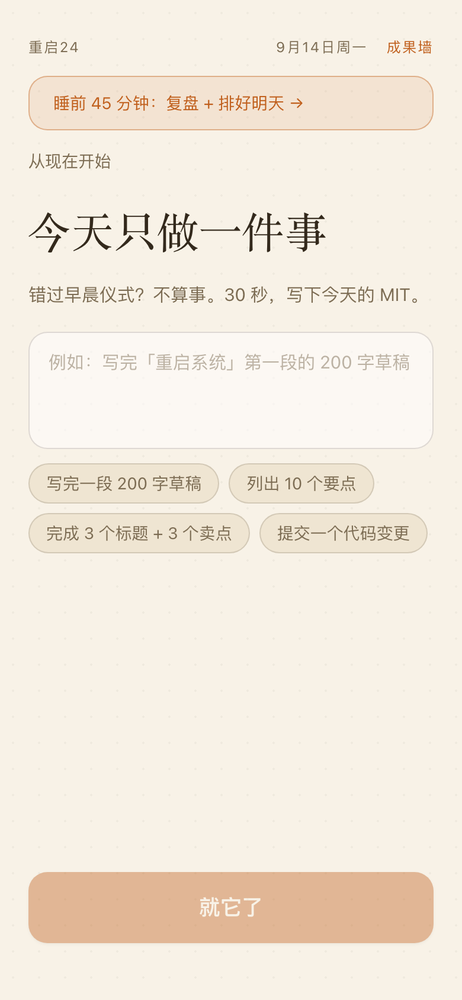
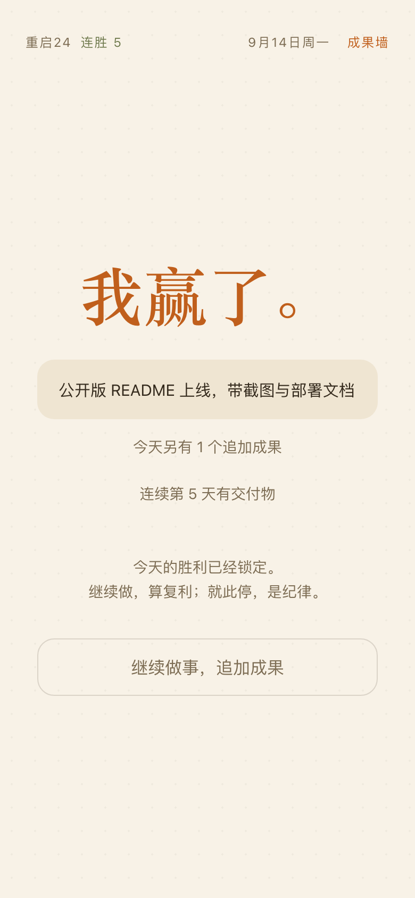
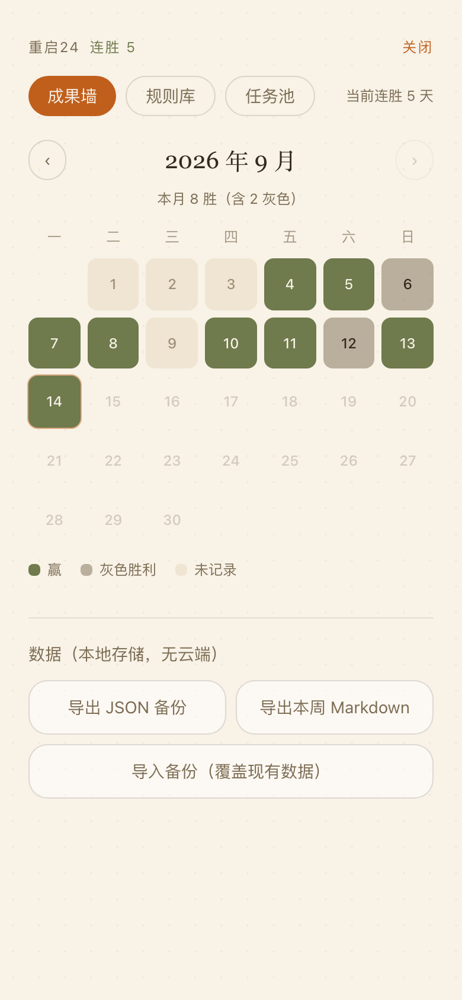

<div align="center">


# 重启24

**把「改变生活」拆成今天就能交付的一件事。**

反意志力的 24 小时重启系统 —— 一个本地优先、可离线安装的 PWA 仪式引导器。

[线上体验](https://langrenxdh.github.io/restart24/) · [设计文档](./DESIGN.md) · [提交反馈](https://github.com/langrenxdh/restart24/issues)

[](https://langrenxdh.github.io/restart24/)
[](./LICENSE)
[](https://react.dev)
[](https://www.typescriptlang.org)
[](https://vite.dev)
[](https://web.dev/progressive-web-apps/)

<table>
  <tr>
    <td align="center"><br /><sub>今天只做一件事</sub></td>
    <td align="center"><br /><sub>赢的时刻</sub></td>
    <td align="center"><br /><sub>成果墙</sub></td>
  </tr>
</table>

</div>

---

## 目录

- [它是什么](#它是什么)
- [核心理念](#核心理念)
- [一个完整的 24 小时](#一个完整的-24-小时)
- [功能特性](#功能特性)
- [快速开始](#快速开始)
- [数据与隐私](#数据与隐私)
- [技术栈](#技术栈)
- [自托管部署](#自托管部署)
- [已知限制](#已知限制)
- [路线图](#路线图)
- [参与贡献](#参与贡献)
- [致谢](#致谢)
- [License](#license)

## 它是什么

大多数待办应用的问题：它们记录你的**意图**，但不保护你的**注意力**。清单越拉越长，每划掉一项的成就感却越来越淡。

重启24 不是另一个待办清单。它是一天的**仪式引导器**：从睡前准备到次日晨间，用一套固定的流程把你从「想改变」推进到「今天已经交付了什么」。每天只问一个问题——

> **今天结束时，什么算赢？**

答案必须是一个可见的交付物：一段写完的草稿、一次完成的训练、一个提交的变更。不是「忙了一天」，而是**能拿给别人看的东西**。

## 核心理念

| 理念 | 含义 |
| --- | --- |
| **反意志力** | 不依赖自律。启动成本靠仪式和流程压到最低：晨间 3 步唤醒、30 秒压缩版、专注前先写承诺 |
| **一天一个 MIT** | Most Important Task，唯一的任务 = 唯一的标准。多任务？进任务池，明天再选 |
| **可见交付物** | 「做完」不算赢，「能展示」才算。赢被明确定义，才可能被反复赢得 |
| **永不责备** | 崩掉的一天有 10 分钟应急版：灰色胜利同样计数，链条不断。系统不羞辱人，只给出路 |

## 一个完整的 24 小时

| 时段 | 模式 | 做什么 |
| --- | --- | --- |
| 晨间醒来 | ☀️ 晨间启动 | 3 步身体唤醒 + 选定今天唯一的 MIT；昨夜写下的锚点自动接力成第一张卡 |
| 上午 | 🎯 深度执行 | 25/45 分钟专注轮，开轮前先写「这一轮我交付 ___」；卡住了给降级动作，不换方向 |
| 12:00–18:00 | 🧭 午间复位 | 三行复位卡：上午完成什么（自动带入）· 下午一件事 · 几点开始 |
| 任意时刻 | 🏆 赢的时刻 | 记录今日可见交付物 →「我赢了」。锁定后仍可继续做事、追加成果，全部入档 |
| 崩掉的一天 | 🛟 失控日应急 | 「今天崩了」常驻入口：压缩成 10 分钟版 → 内置计时 → 灰色胜利，链条不断 |
| 20:00 后 | 🌙 晚间回望 | 约 45 分钟复合流程：复盘 5 问 → 记录成果 → 排明天第一项 → 前夜清障 → 写一条 If-Then |

## 功能特性

- **基于时间戳的计时器** —— 刷新、锁屏、中途退出都不漂移，回来可恢复进行中的专注轮
- **连胜链条** —— 连续交付天数常驻页眉；灰色胜利同样计数（详见[核心理念](#核心理念)）
- **任务池** —— 多任务现实与「一天一个 MIT」的折中：池子是明天的候选清单，不是义务清单；晚间流程对没完成的任务强制三选一处置（顺延 / 放回池 / 放弃）
- **If-Then 规则库** —— 把「卡住了怎么办」沉淀成可复用的个人规则，记录使用次数
- **成果墙** —— 月历热力图（绿 = 赢 / 灰 = 灰色胜利），点开任意一天看交付物与专注轮次
- **数据自主** —— JSON 全量备份 / 导入 + 本周 Markdown 周报导出
- **PWA** —— 添加到主屏幕，全屏 standalone 运行，Service Worker 离线可用
- **本地优先** —— 数据存在浏览器 IndexedDB，无账号、无后端、无追踪

## 快速开始

### 直接使用

打开 [线上地址](https://langrenxdh.github.io/restart24/)，然后装到主屏幕当原生 App 用：

- **iOS Safari**：分享 → 添加到主屏幕
- **Android Chrome**：菜单 → 安装应用

### 本地开发

```bash
git clone https://github.com/langrenxdh/restart24.git
cd restart24
npm install
npm run dev        # http://localhost:5173
```

| 命令 | 说明 |
| --- | --- |
| `npm run dev` | 开发服务器（同一 Wi-Fi 下手机可用 `http://<电脑IP>:5173` 访问） |
| `npm run build` | 生产构建，产物在 `dist/` |
| `npm run preview` | 本地预览生产构建 |
| `npm run typecheck` | TypeScript 严格模式类型检查 |

截图工具：`node scripts/screenshot.mjs <url> <输出.png>`（无头 Chrome，等待真实渲染完成）。

## 数据与隐私

**你的数据不出你的设备。**

- 全部数据存在浏览器 IndexedDB（[Dexie](https://dexie.org)），无账号、无后端、无分析埋点
- 备份：成果墙 → 数据 → 导出 JSON（含任务池与规则库）；换设备时导入即可迁移
- ⚠️ 数据按浏览器隔离：清浏览器数据会清空应用数据，请定期导出备份

## 技术栈

| 层 | 选型 | 说明 |
| --- | --- | --- |
| 框架 | [React 19](https://react.dev) + [TypeScript 5](https://www.typescriptlang.org)（strict） | 无状态管理库，本地 state + 事务化写库 |
| 构建 | [Vite 6](https://vite.dev) | `BASE_PATH` 环境变量适配子路径部署 |
| 样式 | [Tailwind CSS 4](https://tailwindcss.com) | `@theme` 令牌：暖色纸质主题，零 UI 组件库 |
| 存储 | [Dexie 4](https://dexie.org) / IndexedDB | 三表结构（days / rules / tasks），带版本迁移与启动清扫 |
| PWA | [vite-plugin-pwa](https://vite-pwa-org.netlify.app) / Workbox | 仅 build/preview 注入 Service Worker，开发模式不缓存 |

刻意保持零运行时 UI 依赖——整个应用只有 3 个 runtime 依赖（react / react-dom / dexie）。

## 自托管部署

`dist/` 是纯静态产物，任何静态托管都能跑：

1. **GitHub Pages（本项目在用）**：fork 后在 Settings → Pages 选 GitHub Actions，push `main` 即自动部署（约 1 分钟）。仓库内置的 workflow 会自动设置 `BASE_PATH=/<仓库名>/`
2. **Vercel / Netlify / Cloudflare Pages**：构建命令 `npm run build`，输出目录 `dist`
3. **任意静态服务器**：`npm run build` 后把 `dist/` 放到任意 Web 根目录

图标生成：`node scripts/gen-icons.mjs`（零依赖脚本，纸底 + 赭橙圆 + 白色「24」）。

## 已知限制

浏览器对网页通知限制严格（尤其 iOS）。提醒策略按可靠性排序：

1. **应用内横幅**：App 开着时，20:00 提醒晚间流程、22:00 提醒未交付兜底——最可靠
2. **页面通知**：桌面 Chrome / Android 可开启系统通知（尽力而为）
3. **系统闹钟（推荐）**：给晨间配一个系统闹钟。这是设计内的兜底方案，不是缺陷：闹钟响 → 打开主屏图标，两步进入今天的 MIT

## 路线图

- [x] M1 心跳：状态机 + 晨间 MIT + 专注计时 + 记交付物
- [x] M2 接力：晚间复合流程 + 锚点跨天
- [x] M3 保护：复位卡 + 失控日应急 + 链条完整逻辑
- [x] M4 回望：成果墙热力图 + 规则库 + 导入导出
- [x] M5 打磨：PWA 安装/离线 + 应用内提醒 + 安装引导
- [x] 多任务现实：赢后继续 + 任务池（候选清单哲学）

想法池与明确的「不做清单」见 [DESIGN.md](./DESIGN.md) §10–11。

## 参与贡献

欢迎 [Issue](https://github.com/langrenxdh/restart24/issues) 和 PR。约定：

- `npm run typecheck` 通过（strict 模式）
- 界面文案保持中文、教练式语气（具体到能照做，永不责备）
- 新功能先开 Issue 讨论方向，尤其是与「一天一个 MIT」哲学冲突的功能

## 致谢

- 方法论来自 YouTube 上的「24 小时改变生活 / 24-hour restart system」类视频：晚间准备 → 晨间仪式 → 单一 MIT → 深度工作 → 午后复位 → 晚间复盘
- 连胜链条的思路源自经典的「别断链」（Don't Break the Chain）习惯策略

## License

[MIT](./LICENSE) © langrenxdh
